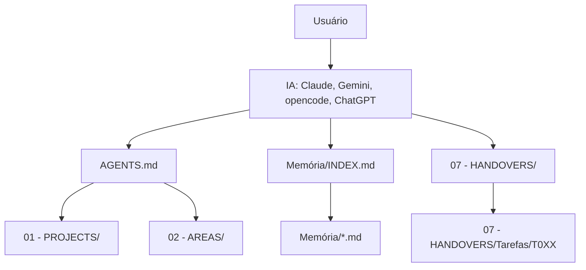
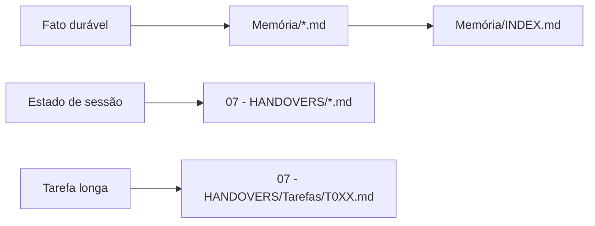
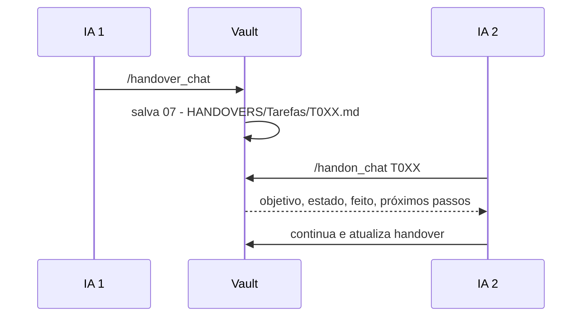
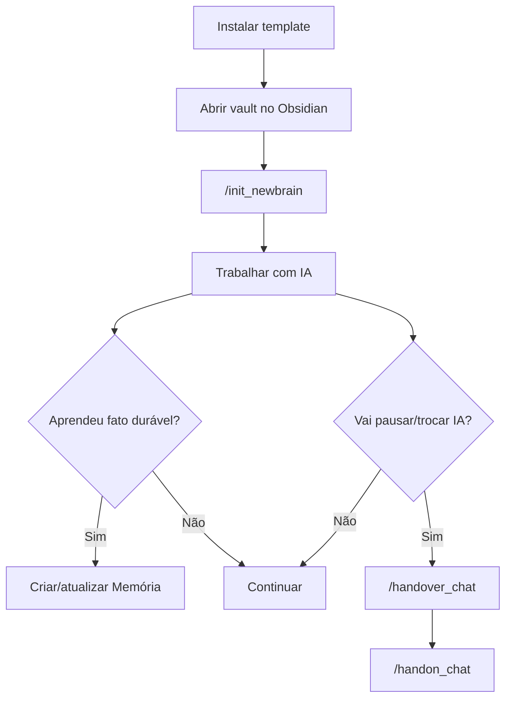

# Vault Brain

Template de vault Obsidian para usar IA com contexto persistente, memória versionada e continuidade entre ferramentas como Claude Code, Gemini CLI, opencode, ChatGPT e modelos locais.

A ideia é simples: o conhecimento importante fica em arquivos Markdown dentro do vault. A IA lê o contexto certo no começo, escreve decisões duráveis em `Memória/`, salva estado de trabalho em `07 - HANDOVERS/` e consegue retomar depois sem depender do histórico do chat.

## Instalação

Pré-requisitos:

- Obsidian
- Git
- Uma ferramenta de IA, como Claude Code, Gemini CLI ou opencode

Clone e rode o setup:

```bash
git clone https://github.com/PedroHenrique0713/brain-template
cd brain-template
bash setup.sh
```

Depois abra `brain-template/vault/` no Obsidian como vault.

## Onboarding

O primeiro passo real é rodar `/init_newbrain`. Ele personaliza o vault para você:

- cria ou atualiza `AGENTS.md`;
- mantém `CLAUDE.md` e `GEMINI.md` como ponte fina;
- cria `Memória/user-profile.md`;
- atualiza `Memória/INDEX.md`;
- cria pastas iniciais de projetos, áreas e estudos;
- registra seu estilo de colaboração com IA.

Com Claude Code:

```bash
cd brain-template/vault
claude
```

Depois rode:

```text
/init_newbrain
```

Com Gemini CLI ou outro modelo sem slash commands, peça:

```text
Leia AGENTS.md e .claude/commands/init_newbrain.md, depois siga o onboarding.
```

## Arquitetura



### Canônico

Estes arquivos são fonte de verdade:

| Arquivo/pasta | Papel |
|---|---|
| `AGENTS.md` | Contexto principal do vault para qualquer IA |
| `Memória/INDEX.md` | Índice dos fatos duráveis |
| `Memória/*.md` | Memória semântica, um fato por arquivo |
| `07 - HANDOVERS/` | Estado episódico de sessões e tarefas |
| `01 - PROJECTS/`, `02 - AREAS/`, `06 - KNOWLEDGE/` | Referência de projetos, áreas e conhecimento |

### Não canônico

Estes arquivos não devem duplicar contexto:

| Arquivo/pasta | Papel |
|---|---|
| `CLAUDE.md` | Só aponta para `AGENTS.md` |
| `GEMINI.md` | Só aponta para `AGENTS.md` |
| `.claude/commands/` | Procedimentos reutilizáveis, não memória |
| `.opencode/config.toml` | Configuração de ferramenta |

`CLAUDE.md` e `GEMINI.md` existem porque algumas ferramentas carregam esses nomes automaticamente. O conteúdo de verdade fica em `AGENTS.md`.

## Memória

Existem dois tipos principais de continuidade:



Use `Memória/` para fatos que continuam verdadeiros daqui a meses:

- preferências de trabalho;
- decisões técnicas;
- contexto estável de projeto;
- regras de colaboração;
- causas-raiz importantes.

Não use `Memória/` para:

- pendências momentâneas;
- “atualmente”;
- conteúdo que já está registrado no git;
- resumo de uma sessão específica.

Um fato deve seguir este padrão:

```markdown
---
name: slug-do-fato
description: resumo curto
type: project | feedback | user | reference
scope: global
updated: YYYY-MM-DD
---

Texto do fato.

**Why:** por que isso importa.
**How to apply:** como a IA deve usar esse fato.
```

Depois adicione uma linha em `Memória/INDEX.md`:

```markdown
- [Título](slug-do-fato.md) — `scope` — gancho curto
```

## Handover e Handon

Handover é memória episódica: onde uma sessão parou.

Use `/handover_chat` quando terminar uma sessão, trocar de IA ou pausar uma tarefa. Ele salva:

- objetivo atual;
- estado exato;
- o que já foi feito;
- próximos passos;
- decisões técnicas;
- armadilhas de contexto.

Use `/handon_chat` para retomar:

- listar handovers ativos;
- abrir o mais recente;
- abrir uma tarefa específica (`T001`, `T002`, etc.).



Regra prática:

- `Memória/` responde “o que saber”.
- `07 - HANDOVERS/` responde “onde parei”.

## Commands

Os procedimentos ficam em `.claude/commands/`. Eles são Markdown puro, então funcionam como slash commands no Claude Code ou como instruções copiadas para outras IAs.

| Command | Uso |
|---|---|
| `/init_newbrain` | Onboarding e personalização inicial |
| `/update_brain` | Migra a estrutura de um vault antigo (v1) para a atual, sem perder dados |
| `/handover_chat` | Salvar estado da sessão |
| `/handon_chat` | Retomar sessão ou tarefa |
| `/vault_scan` | Criar referências cruzadas entre notas |
| `/vault_gc` | Manutenção: arquivar handovers, validar memória e triagem do INBOX |

## Atualizar

Já tem um vault rodando e quer puxar as novidades do template (commands novos, correções) **sem perder seus dados**? Sempre rode **de dentro da pasta do seu vault**.

**Linux / Mac (ou Windows com Git Bash):**

```bash
curl -sL https://raw.githubusercontent.com/PedroHenrique0713/brain-template/main/update.sh | bash
```

```bash
curl -sL .../update.sh | bash -s -- --dry-run   # só mostra o que mudaria
curl -sL .../update.sh | bash -s -- --prune     # também remove commands obsoletos
```

**Windows (sem Git Bash, mas com Node.js):** use a versão em Node — funciona no PowerShell/terminal do VS Code. Baixe e rode:

```powershell
irm https://raw.githubusercontent.com/PedroHenrique0713/brain-template/main/update.mjs -OutFile update.mjs ; node update.mjs
```

Depois é só `node update.mjs` (ou `node update.mjs --dry-run` / `--prune`). O `update.mjs` é cross-platform — roda igual em Windows, Mac e Linux, basta ter Node 18+.

> PowerShell/CMD puros **não** rodam o `update.sh` (não têm `bash`). Use o `update.mjs`, ou abra o **Git Bash**.

Os dois atualizadores fazem a mesma coisa: mostram banner + **release notes**, e sincronizam **só o framework** (`.claude/commands/`). **Nunca tocam** em `AGENTS.md`, `CLAUDE.md`/`GEMINI.md`, `Memória/`, projetos, handovers ou INBOX. A versão sincronizada fica em `.claude/.brain-version`; as notas estão no [CHANGELOG.md](CHANGELOG.md).

> Migrar a **estrutura** da v1 (skills → commands, conteúdo do `CLAUDE.md` → `AGENTS.md`) é outra coisa: isso é feito pelo onboarding `/update_brain`, que pede confirmação antes de mexer no seu perfil.

## Estrutura

```text
vault/
├── 00 - INBOX/
├── 01 - PROJECTS/
├── 02 - AREAS/
├── 03 - RESOURCES/
│   └── Templates/
├── 04 - DIARY/
├── 05 - MEETINGS/
├── 06 - KNOWLEDGE/
├── 07 - HANDOVERS/
│   ├── Tarefas/
│   └── Arquivo/
├── Memória/
│   └── INDEX.md
├── AGENTS.md
├── CLAUDE.md
└── GEMINI.md
```

## Fluxo recomendado



## Backup

O vault é só uma pasta Markdown. Para versionar:

```bash
cd brain-template/vault
git init
git remote add origin https://github.com/SEU_USUARIO/meu-vault.git
git add .
git commit -m "primeiro backup"
git push -u origin main
```

Use repositório privado se o vault tiver dados pessoais.
