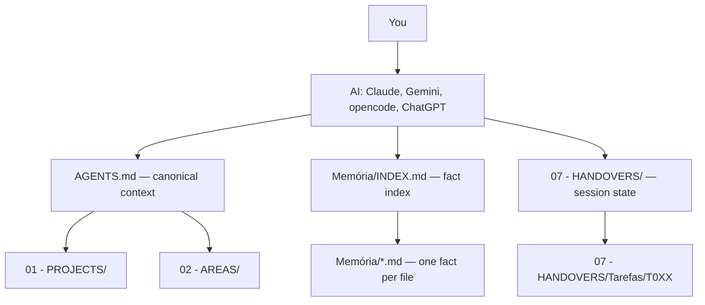
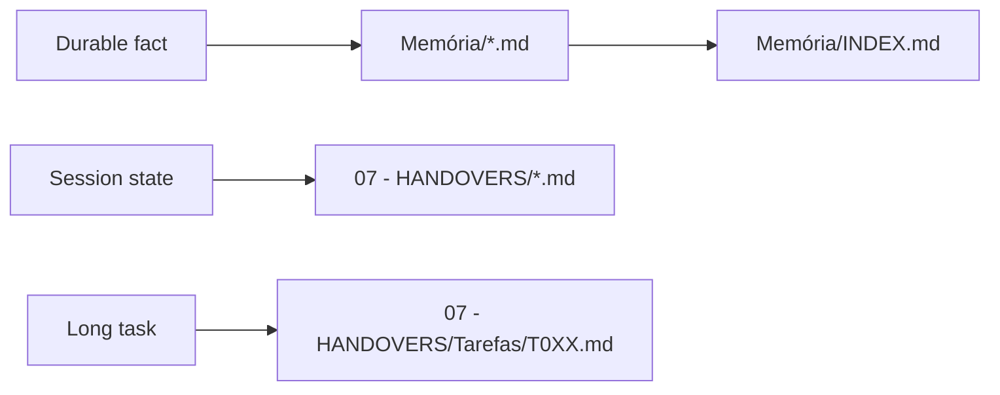
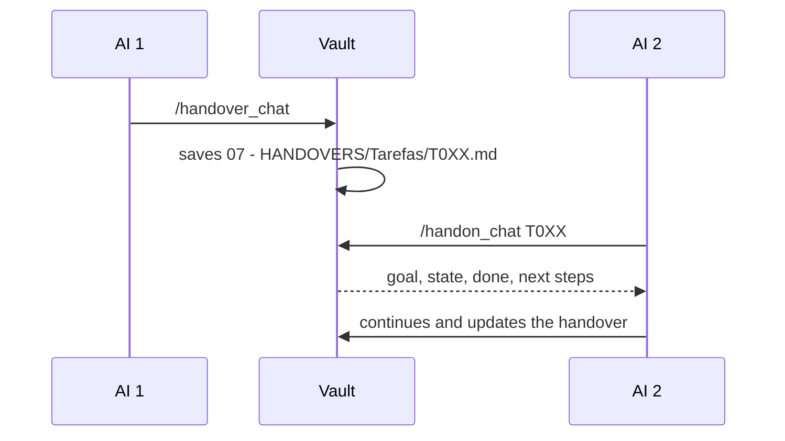

<div align="center">

# Vault Brain

**A persistent, versioned brain for your AI tools.**

An Obsidian vault template where Claude Code, Gemini CLI, opencode and ChatGPT
share the same memory — durable facts, session state and project context live
in plain Markdown, versioned in git. Start a task in one AI, finish it in
another, come back weeks later: nothing is lost with the chat history.

🇧🇷 [Leia em português](README.pt-BR.md)

<br>

<a href="LICENSE"></a>


</div>

---

## Why

Every AI coding tool forgets. Context windows end, sessions expire, and the
knowledge you built with one vendor is locked inside it. Vault Brain flips the
ownership: **you** author the memory, in files you can read, diff and take to
any model. The AI reads the right context at session start, writes durable
decisions to `Memória/` (memory), saves working state to `07 - HANDOVERS/`,
and the next session — same tool or a different one — picks up exactly where
the last one stopped.

- **No lock-in** — plain Markdown + git. Switch AI vendors without losing your brain.
- **Memory you can audit** — one fact per file, with *why* and *how to apply*.
- **Cross-AI continuity** — handover/handon protocol between Claude, Gemini, opencode and others.
- **One canonical context** — `AGENTS.md` is the single source of truth; `CLAUDE.md`/`GEMINI.md` are thin pointers loaded automatically by each tool.

## Quickstart

Prerequisites: [Obsidian](https://obsidian.md), git, and an AI tool
(Claude Code, Gemini CLI or opencode).

```bash
git clone https://github.com/PedroHenrique0713/brain-template
cd brain-template
bash setup.sh
```

Open `brain-template/vault/` in Obsidian as a vault. Then run the onboarding —
with Claude Code:

```bash
cd brain-template/vault
claude
```

```text
/init_newbrain
```

The onboarding (~27 questions) personalizes `AGENTS.md`, creates your
`Memória/user-profile.md`, sets up initial project/area folders and records
your collaboration style. With a tool that has no slash commands, just ask:
*"Read AGENTS.md and .claude/commands/init_newbrain.md, then follow the onboarding."*

## How it works



**Canonical** (source of truth): `AGENTS.md`, `Memória/INDEX.md` + `Memória/*.md`,
`07 - HANDOVERS/`, and the reference folders (`01 - PROJECTS/`, `02 - AREAS/`,
`06 - KNOWLEDGE/`).

**Non-canonical** (never duplicate context there): `CLAUDE.md` and `GEMINI.md`
(thin pointers that exist only because tools auto-load those filenames) and
`.claude/commands/` (reusable procedures, not memory).

## Two kinds of continuity



**`Memória/` answers "what to know"** — work preferences, technical decisions,
stable project context, root causes. One fact per file:

```markdown
---
name: fact-slug
description: short summary
type: project | feedback | user | reference
scope: global
updated: YYYY-MM-DD
---

The fact itself.

**Why:** why it matters.
**How to apply:** how the AI should use it.
```

…plus one line in `Memória/INDEX.md`. Don't store momentary state, "currently…",
or anything git already records.

**`07 - HANDOVERS/` answers "where I stopped"** — run `/handover_chat` when
ending a session, switching AIs or pausing a task (saves goal, exact state,
done, next steps, decisions, traps). Run `/handon_chat` to resume:



## Commands

Procedures live in `.claude/commands/` as plain Markdown — slash commands in
Claude Code, copy-paste instructions anywhere else.

| Command | Purpose |
|---|---|
| `/init_newbrain` | Onboarding and initial personalization |
| `/update_brain` | Migrate an old (v1) vault structure to the current one, losslessly |
| `/handover_chat` | Save session state |
| `/handon_chat` | Resume a session or task |
| `/vault_scan` | Cross-reference new notes |
| `/vault_gc` | Maintenance: archive handovers, validate memory, triage the inbox |

## Updating

Pull framework updates (new commands, fixes) into an existing vault **without
touching your data**. Always run from inside your vault folder.

Linux / macOS (or Windows with Git Bash):

```bash
curl -sL https://raw.githubusercontent.com/PedroHenrique0713/brain-template/main/update.sh | bash
```

Windows without Git Bash (needs Node 18+) — cross-platform updater:

```powershell
irm https://raw.githubusercontent.com/PedroHenrique0713/brain-template/main/update.mjs -OutFile update.mjs ; node update.mjs
```

Both support `--dry-run` and `--prune`. They sync **only** the framework
(`.claude/commands/`) and never touch `AGENTS.md`, `Memória/`, projects,
handovers or the inbox. Synced version lives in `.claude/.brain-version`;
notes in the [CHANGELOG](CHANGELOG.md).

## Structure

```text
vault/
├── 00 - INBOX/
├── 01 - PROJECTS/
├── 02 - AREAS/
├── 03 - RESOURCES/
├── 04 - DIARY/
├── 05 - MEETINGS/
├── 06 - KNOWLEDGE/
├── 07 - HANDOVERS/
│   ├── Tarefas/          # long-running tasks (T0XX)
│   └── Arquivo/          # archived history
├── Memória/              # semantic memory (one fact per file)
│   └── INDEX.md
├── AGENTS.md              # canonical context
├── CLAUDE.md              # thin pointer
└── GEMINI.md              # thin pointer
```

## Backup

The vault is just a Markdown folder — version it:

```bash
cd brain-template/vault
git init && git remote add origin https://github.com/YOU/my-vault.git
git add . && git commit -m "first backup" && git push -u origin main
```

Use a **private** repository if the vault holds personal data.

## Language note

The template's onboarding and command prompts are currently Portuguese-first
(the AI answers in whatever language you configure during onboarding). Full
English localization of the internals is on the roadmap — contributions welcome.

## License

MIT © Pedro Henrique — see [LICENSE](LICENSE).
